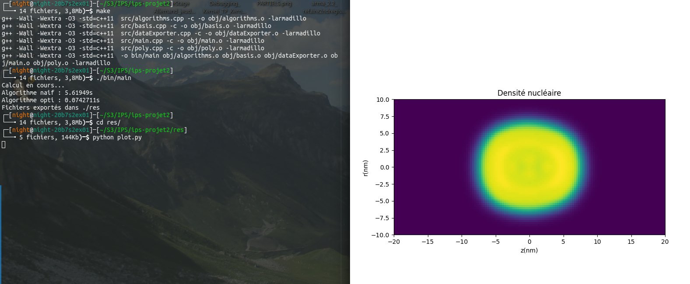
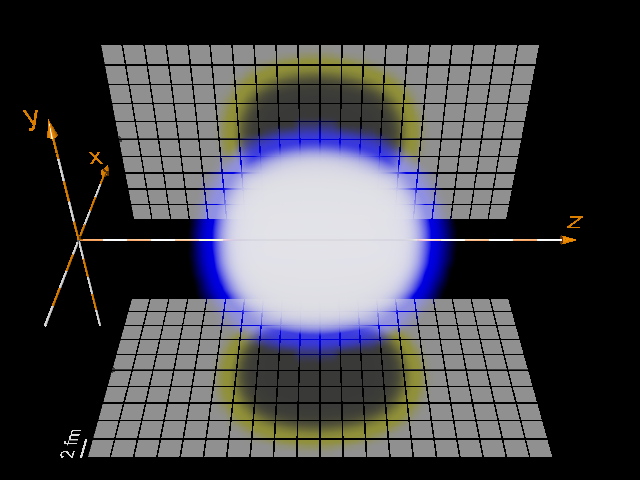

# Densité nucléaire 3D

Suite de ce . 

Une présentation de ce projet est disponible dans <code>pres/index.html</code>.

## Description

Le but de ce projet est de calculer les solutions de l'équation d'un oscillateur harmonique quantique généralisées, puis d'afficher la densité nucléaire d'un système (approximation par une triple somme), avec un algorithme optimisé.

Ces solutions possèdent des propriétés qui seront également vérifiées, par des tests unitaires.

L'éxécutable effectue le calcul des fonctions d'onde, de la densité locale avec un algorithme naïf puis un algorithme optimisé (ordre et contenu des boucles), exporte les données dans une matrice dans res/ que l'on pourra afficher.

Pour afficher la densité en 3D "cube", on utilise povray.

## Commandes make

-Pour compiler l'exécutable, utilisez <code>make</code>.

-Pour lancer les tests, utilisez <code>make runtests</code> qui se chargera d'utiliser le makefile du dossier tests/.

-Pour générer la documentation, utilisez <code>make docs</code> qui est équivalent à <code>doxygen Doxygen</code>.

-Pour formater le code selon le astyle, utilisez <code>make format</code>.

-Pour clean les dossiers obj, astyle, ou de tests, utilisez <code>make clean</code> dans le bon dossier.

## Dossiers

-docs => Pour la génération de docs style doxygen

-headers => Pour les fichiers *.h

-obj => Pour les fichiers *.o

-src => Pour les fichiers *.cpp

-target => Dossier qui contient les exécutables, les fichiers à la fin de la chaîne de compilation

-tests => Pour les tests

## Installer armadillo

```
sudo apt update #sudo pacman -Syu
sudo apt install liblapack-dev && sudo apt install libblas-dev && sudo apt install libboost-dev
sudo apt install libarmadillo-dev #yay -S armadillo
```

## Résultats

```
#2D
cd res
python plot.py
```



```
#3D
cd res/df3
sudo apt install povray #sudo pacman -S povray
povray +A0.0001 -W800 -H600 +P +Q11 visu.pov
```



## Crédits

Consulter https://dubrayn.github.io/ pour plus de détails.
